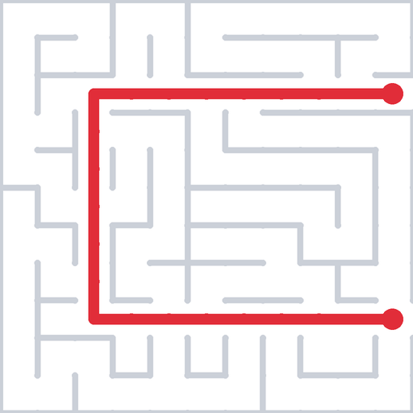

<p align="center">
  
</p>

# Clew

**A trust-first grant agent for small nonprofits, right inside Slack.**

Clew learns your organization once, finds *real, currently-available* grants from free
public data, screens each one against your mission, geography, program areas, and
grant-size range, and runs the whole pipeline — shortlist, approval, war room, brief,
application help, board — without your team leaving Slack. Nothing reaches your
shortlist without a real citation attached: no invented funders, no fabricated grant
sizes, no guessed deadlines.

Built for the small teams who actually do this work: solo executive directors writing
grants themselves, volunteer-run organizations, and 2–5 person development teams
priced out of the $200–600/month research tools.

The name comes from "clew" — the literal root of the word "clue," the ball of thread
Ariadne gave Theseus so he could find his way back out of the labyrinth. Same idea: a
thread through a maze of funders to the ones that actually fit.

Built for the **Slack Agent Builder Challenge ("Agent for Good")**. The full loop —
onboarding → cited shortlist → approve → war room → brief → pipeline board — is
verified live in a real Slack workspace. Submission materials live in
[`docs/`](docs/) (Devpost text, architecture diagram, video script).

---

## What it does

- **Learn the org once.** Paste your website and Clew drafts your whole profile —
  mission, geography, program areas, grant-size range — in seconds. Or tell it about
  your org in chat, or use the guided form. All three land in the same profile.
- **Find real, cited grants.** "Find grants" runs a full sweep across three free
  public sources — [Grants.gov](https://grants.gov) (open federal opportunities),
  [ProPublica's Nonprofit Explorer](https://projects.propublica.org/nonprofits/)
  (foundation 990 data), and [USAspending.gov](https://www.usaspending.gov)
  (historical awards) — screens every result against your profile, and posts a short
  shortlist as Block Kit cards with fit rationale, cited sources, and
  **Approve / Pass** buttons.
- **Approve → a war room.** Approving a grant spins up a dedicated `#grant-<name>`
  channel, invites you, and pins an AI **brief** — funder, amount, deadline,
  requirements — everything cited, anything unverifiable quarantined in a VERIFY
  list. Inside the room, "help me apply" just works: fit summary, application
  outline, boilerplate in your org's voice, requirements checklist.
- **Run the pipeline in Slack.** A stage funnel and board live on the App Home tab —
  qualified → approved → applied → submitted → awarded — with deadline flags,
  report-due reminders, and a short org-learning retro after each win or loss. App
  Home also shows a live **"What Clew can see"** transparency panel.
- **Know your history.** Ask what any org (yours, a peer, a grantee) has won and
  Clew pulls its real federal award history from USAspending, cited, and flags
  recurring funders.
- **Warm-path detection.** With OAuth installed, Clew checks your workspace's own
  message history (Slack Real-Time Search API) for prior mentions of a funder before
  surfacing it — and grounds its channel replies in what your team actually
  discussed. Degrades gracefully (never fabricates a "no mentions" claim) when
  unavailable.

## The trust boundary is enforced, not promised

The only way a prospect reaches your shortlist is through one tool —
`save_qualified_prospect` — and that tool **rejects any prospect whose citations
aren't real URLs from a source Clew actually queried** (grants.gov, propublica.org,
usaspending.gov). No citation, no shortlist. The agent *cannot* hand you an uncited
grant even if it tries. In the nonprofit world a made-up funder or a wrong deadline
isn't a cute hallucination — it's a wasted week the team didn't have.

## Architecture

Slack (Bolt for Python, Socket Mode + OAuth) → an agent built on the **Claude Agent
SDK** (`ClaudeSDKClient`, per-thread sessions) → a custom in-process **MCP server**
(`clew-grant-tools`) exposing nine tools:

| Tool | What it does |
|---|---|
| `search_grants_gov` | Open federal grant opportunities |
| `search_propublica_orgs` | Foundations via ProPublica Nonprofit Explorer |
| `get_990_filings` | A foundation's giving scale from IRS 990s |
| `search_usaspending` | Historical federal award evidence |
| `get_org_award_history` | An org's own federal funding history, cited |
| `search_workspace` | Warm-path detection via Real-Time Search |
| `fetch_org_website` | Draft the org profile from a URL |
| `save_org_profile` | Persist the profile |
| `save_qualified_prospect` | The enforced citation gate onto the shortlist |

All state — the org profile and every prospect through every lifecycle stage — lives
in a single SQLite file (`storage/db.py`); the shortlist cards, App Home
funnel/board, war-room briefs, and lifecycle reminders are all views or transitions
on that one table. Every grant API call is timeout-bounded and degrades to a clean
"unavailable" rather than freezing a search or fabricating a result.

**Security lockdown:** the agent's built-in filesystem/shell/web tools are
disallowed — only the namespaced `clew-grant-tools` are allowed, so the agent can
research grants and nothing else.

See [`docs/architecture.svg`](docs/architecture.svg) for the full diagram.

## The Clew web board

**https://clew-board.vercel.app** — a live, read-only view of the same pipeline for
board members who don't have Slack: profile, pipeline stats, and every prospect by
stage with deadlines and cited sources. The Slack app serves `GET /api/board` (port
3001, bearer-auth) from the same SQLite the agent's tools write; the Next.js app in
`web/` polls it. Boards are reachable only through **signed per-org HMAC links**, so
one org can't read another's pipeline. All actions happen in Slack — the board
visualizes them in real time.

## Setup

### Prerequisites

- A Slack workspace where you can install apps (see `manifest.json` for scopes)
- An [Anthropic API key](https://console.anthropic.com/settings/keys)
- Python 3.12+

### Install and run

```sh
git clone <this-repo> clew
cd clew
python3 -m venv .venv
source .venv/bin/activate
pip install -r requirements.txt

cp .env.sample .env   # add ANTHROPIC_API_KEY + Slack tokens

.venv/bin/python app.py          # Socket Mode bot + board API on :3001
```

On first run, `storage/db.py` creates `clew.db` in the project root automatically.

To keep it alive unattended locally: `bash scripts/run_clew.sh`. In production the
bot runs as a Docker container on Railway (see `Dockerfile`; volume at `/app/data`
for SQLite + persisted OAuth installs, everything served on one `$PORT`).

### Optional: warm-path detection (Real-Time Search API)

Workspace search requires an OAuth install (not just Socket Mode). Run
`app_oauth.py` **instead of** `app.py` — it serves the OAuth endpoints
(`/slack/install`, `/slack/oauth_redirect`) over HTTP while still receiving events
over Socket Mode. Never run both: each opens its own Socket Mode connection and
every event gets handled twice. Set `SLACK_CLIENT_ID` / `SLACK_CLIENT_SECRET` /
`SLACK_REDIRECT_URI` in `.env` (the redirect URL registered in the Slack app config
must match exactly — e.g. a tunnel URL + `/slack/oauth_redirect`). The install
persists to `data/installations/`, so it survives restarts; the tunnel is only
needed to (re)install. Without OAuth, Clew works fully — it just skips the
warm-path check rather than guessing.

### Using it

Open the app in Slack:

1. In the **Messages** tab, click **Set Up Org Profile** — or just paste your
   org's website URL.
2. Click **Find Grants**. Clew sweeps the sources, screens for fit, and posts
   qualified prospects as cited cards. (A full sweep takes a couple of minutes.)
3. **Approve** a card to spawn its war room and pinned brief; try "help me apply"
   inside it.
4. Track everything on the **Home** tab — the pipeline funnel, the board, and the
   "What Clew can see" panel.

**Which surface, when?** Clew lives in three places, each with a job:

- **The Clew DM (Agents & Apps)** is your personal cockpit — set up or edit the
  org profile, say `clew briefing` for the morning rundown, `reset clew` to wipe
  the demo, and run private searches. No @mention needed; the **Home** tab next
  to it is the dashboard.
- **Regular channels** are for team-visible work — `@clew` it and the cited
  cards, Approve/Pass decisions, and replies (grounded in that channel's recent
  history) happen in the open where colleagues can weigh in.
- **War rooms** (`#grant-…`) are per-grant workspaces Clew creates when you
  Approve — inside one, `@clew` already knows which grant the room is for, with
  the brief pinned, the deadline in the topic bar, drafts in the canvas, and
  grant-scoped buttons: draft the application, open the funder's site, and
  **designate tasks** — Clew proposes the action items and each one is handed
  to a teammate with a people picker (or just say "have @sam pull our
  financials").

There's no wrong door: Clew answers wherever it's asked — channels just need
the @mention.

## Project structure

- **`agent/`** — Claude Agent SDK configuration (`agent.py`), the nine MCP tools
  (`tools/`), org-profile and channel-history context injection.
- **`storage/`** — SQLite schema and CRUD for `org_profile` and `prospects` (the
  single source of truth for the whole lifecycle).
- **`listeners/events`** — App Home, DM, and @mention entry points.
- **`listeners/actions`** — button handlers: org profile, Find Grants, Approve/Pass,
  draft-application, and every board stage transition.
- **`listeners/views`** — every Block Kit surface: App Home (funnel, board,
  transparency panel), shortlist cards, the war-room grant brief, org profile and
  lifecycle modals.
- **`web/`** — the Next.js web board; **`webapi.py`** — the bearer-auth board API
  with HMAC-signed org links.
- **`docs/`** — Devpost text, architecture diagram, video script.

## Roadmap

- **Full funding history:** federal wins are live (`get_org_award_history`); next,
  reconstruct *foundation* funding history from public 990-PF grantee filings — a
  funder graph where every edge is an IRS filing.
- **Salesforce Nonprofit Cloud sync:** import an existing pipeline, push awarded
  grants back — Clew as the system of *action* in Slack alongside the system of
  record.
- **More Slack-native surfaces:** the pipeline as a Slack List, war-room briefs as
  living Canvases.
- **Deadline chasing:** scheduled war-room reminders as a deadline nears.

### Resetting the demo

DM Clew `reset clew` and confirm — this clears the org profile, wipes every
prospect, and archives the `#grant-…` war-room channels so you can run the whole
onboarding flow again from scratch.

## Development

```sh
.venv/bin/ruff check . && .venv/bin/ruff format .
.venv/bin/python -m pytest   # 33 tests
```
